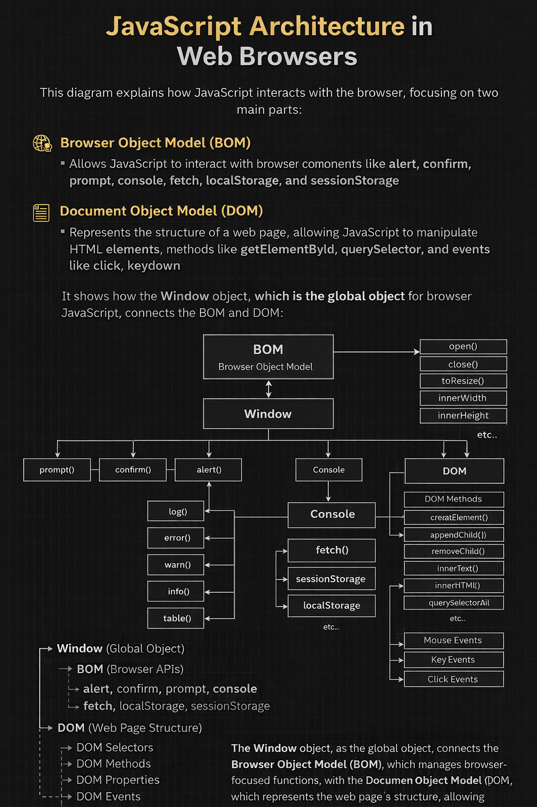
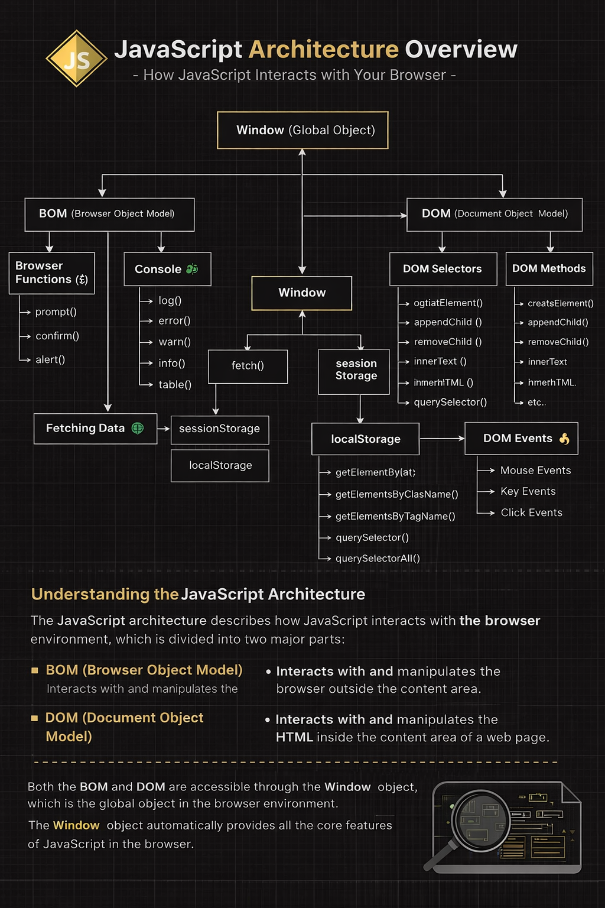

# JavaScript Browser Architecture

This repository explains **how JavaScript interacts with web
browsers**.\
The architecture mainly consists of two major components:

-   **BOM (Browser Object Model)**
-   **DOM (Document Object Model)**

Both are accessed through the **Window Object**, which acts as the
global object in browser-based JavaScript.

------------------------------------------------------------------------

## JavaScript Architecture Diagram




------------------------------------------------------------------------

## Window Object

The **Window object** is the global object in the browser environment.

It provides access to:

-   Browser APIs
-   DOM APIs
-   Console
-   Storage APIs

Example:

``` javascript
window.alert("Hello JavaScript");
```

------------------------------------------------------------------------

## Browser Object Model (BOM)

The **BOM allows JavaScript to interact with the browser itself**.

Common BOM features:

-   `alert()` -- Displays alert message
-   `confirm()` -- Shows confirmation dialog
-   `prompt()` -- Takes input from user
-   `console` -- Debugging tool
-   `fetch()` -- API requests
-   `localStorage` -- Persistent browser storage
-   `sessionStorage` -- Session based storage

Example:

``` javascript
alert("Welcome");
console.log("Debug message");
```

------------------------------------------------------------------------

## Console Object

The console is mainly used for **debugging JavaScript code**.

Common console methods:

-   `console.log()`
-   `console.error()`
-   `console.warn()`
-   `console.info()`
-   `console.table()`

Example:

``` javascript
console.log("Hello Developers");
```

------------------------------------------------------------------------

## Browser Storage

### localStorage

Stores data permanently in the browser.

``` javascript
localStorage.setItem("name","Ashoka");
```

### sessionStorage

Stores data only for the current session.

``` javascript
sessionStorage.setItem("user","Admin");
```

------------------------------------------------------------------------

## Fetch API

Used to **retrieve data from servers or APIs**.

Example:

``` javascript
fetch("https://api.example.com/data")
  .then(res => res.json())
  .then(data => console.log(data));
```

------------------------------------------------------------------------

## Document Object Model (DOM)

The **DOM represents the HTML document as a tree structure**.

JavaScript uses DOM to:

-   Access HTML elements
-   Modify content
-   Change styles
-   Create new elements
-   Remove elements
-   Handle events

------------------------------------------------------------------------

## DOM Selectors

Selectors are used to select HTML elements.

``` javascript
document.getElementById("id")
document.getElementsByClassName("class")
document.getElementsByTagName("tag")
document.querySelector("#id")
document.querySelectorAll(".class")
```

------------------------------------------------------------------------

## DOM Methods

DOM methods allow us to manipulate elements.

``` javascript
document.createElement()
element.appendChild()
element.removeChild()
```

------------------------------------------------------------------------

## DOM Properties

Used to modify HTML content.

``` javascript
element.innerText
element.innerHTML
element.textContent
```

------------------------------------------------------------------------

## DOM Events

Events are **user interactions on web pages**.

Examples:

Mouse Events - click - mouseover - mouseout

Keyboard Events - keydown - keyup

Example:

``` javascript
document.getElementById("btn").onclick = function(){
  alert("Button Clicked");
};
```

------------------------------------------------------------------------

## Summary


    Window (Global Object)
    │
    ├── BOM (Browser Object Model)
    │     ├ alert()
    │     ├ confirm()
    │     ├ prompt()
    │     ├ console
    │     │     ├ log()
    │     │     ├ error()
    │     │     ├ warn()
    │     │     ├ info()
    │     │     └ table()
    │     │
    │     ├ fetch()  (Web API)
    │     ├ localStorage
    │     ├ sessionStorage
    │     ├ location
    │     ├ navigator
    │     └ screen
    │
    └── DOM (Document Object Model)
      │
      ├ DOM Selectors
      │     ├ getElementById()
      │     ├ getElementsByClassName()
      │     ├ getElementsByTagName()
      │     ├ querySelector()
      │     └ querySelectorAll()
      │
      ├ DOM Methods
      │     ├ createElement()
      │     ├ appendChild()
      │     ├ removeChild()
      │     └ replaceChild()
      │
      ├ DOM Properties
      │     ├ innerText
      │     ├ innerHTML
      │     ├ textContent
      │     └ style
      │
      └ DOM Events
            ├ Mouse Events
            │     ├ click
            │     ├ mouseover
            │     └ mouseout
            │
            ├ Keyboard Events
            │     ├ keydown
            │     └ keyup
            │
            └ Form Events
                  ├ submit
                  └ change


----------------------------------------------------------------
